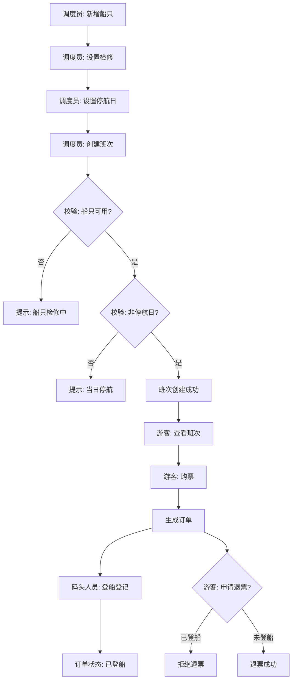

## 1. 产品概述

景区游船班次管理系统是一套面向景区运营的游船调度与售票平台，服务于调度员、游客和码头人员三类角色。核心目标是将船只状态与订单规则严格管控——大风停航日禁止售票、检修中的船不能排班、已登船的订单不可退票，确保运营安全与业务合规。

## 2. 核心功能

### 2.1 用户角色

| 角色 | 进入方式 | 核心权限 |
|------|----------|----------|
| 调度员 | 角色选择页进入 | 管理船只档案、检修记录、班次排期、停航日设置 |
| 游客 | 角色选择页进入 | 查看班次余票、购票、查看我的订单、申请退票 |
| 码头人员 | 角色选择页进入 | 扫码/手选订单登记登船、查看登船记录 |

### 2.2 功能模块

1. **角色入口页**: 三角色身份选择，海洋主题沉浸式入口
2. **调度员工作台**: 船只档案卡片、检修管理、班次排期表、停航日历
3. **游客服务中心**: 班次查询与余票展示、购票流程、我的订单与退票
4. **码头作业台**: 登船登记、登船记录查询

### 2.3 页面详情

| 页面名称 | 模块名称 | 功能描述 |
|----------|----------|----------|
| 角色入口页 | 角色选择 | 展示三个角色入口卡片，点击进入对应工作台 |
| 调度员-船只管理 | 船只档案 | 卡片式展示船只列表，支持新增/编辑船只（名称、载客量、状态） |
| 调度员-检修管理 | 检修记录 | 记录船只检修（开始/结束日期、原因），检修中船只自动标记不可排班 |
| 调度员-班次管理 | 班次排期 | 日历/时间线视图创建班次（选择船只、出发时间、票价），检修船/停航日不可排班 |
| 调度员-停航日历 | 停航设置 | 按日期设置停航（大风等），停航日禁止创建班次和售票 |
| 游客-班次查询 | 班次列表 | 展示可购班次卡片，显示余票、时间、票价，停航日/满员班次置灰 |
| 游客-购票 | 购票流程 | 选择班次、填写人数、确认支付（模拟），生成订单 |
| 游客-我的订单 | 订单管理 | 查看订单列表，未登船可申请退票，已登船订单不可退 |
| 码头-登船登记 | 登船操作 | 选择班次后展示待登船订单，点击登记登船，状态变更为已登船 |
| 码头-登船记录 | 记录查询 | 按日期/班次筛选已登船记录 |

## 3. 核心流程

**调度员排班流程**: 调度员新增船只 → 设置检修（可选）→ 设置停航日（可选）→ 创建班次（系统校验船只可用 & 日期非停航）

**游客购票流程**: 游客查看班次 → 选择班次 → 填写人数 → 确认购票 → 生成订单 → （可选）退票（已登船不可退）

**码头登船流程**: 码头人员选择当日班次 → 查看待登船订单 → 点击登记登船 → 订单状态变更为已登船

## 4. 用户界面设计

### 4.1 设计风格

- **主色调**: 深海蓝 `#0C4A6E` 搭配浪花白 `#F0F9FF`，点缀珊瑚橙 `#F97316` 作为操作按钮强调色
- **辅助色**: 沙滩金 `#FBBF24` 用于警告/停航标记，海雾灰 `#94A3B8` 用于禁用态
- **按钮风格**: 圆角胶囊形按钮，带轻微阴影，悬停时波浪纹动效
- **字体**: 标题使用 Noto Serif SC 衬线体传递文化质感，正文使用 Noto Sans SC 无衬线体保证可读性
- **布局**: 卡片式布局为主，顶部导航栏 + 左侧角色菜单 + 右侧内容区
- **图标风格**: Lucide 线性图标，配合海洋主题微调
- **背景**: 浅色渐变底纹叠加微弱波纹纹理

### 4.2 页面设计概览

| 页面名称 | 模块名称 | UI 元素 |
|----------|----------|---------|
| 角色入口页 | 角色选择 | 三列等宽卡片，各含角色图标与描述，悬停缩放+阴影，波纹渐变背景 |
| 调度员-船只管理 | 船只档案 | 网格卡片，每卡含船名、载客量、状态徽章，右上角编辑/检修按钮 |
| 调度员-检修管理 | 检修记录 | 时间线布局，检修条目含船名、日期范围、原因，进行中项高亮橙边 |
| 调度员-班次管理 | 班次排期 | 左侧日历选日 + 右侧班次时间线，班次卡片含船名、时间、余票进度条 |
| 调度员-停航日历 | 停航设置 | 月历视图，停航日标红，点击切换停航状态，底部显示停航原因输入 |
| 游客-班次查询 | 班次列表 | 大卡片流式布局，每卡含时间、船名、余票、票价，可购卡片蓝色边框 |
| 游客-购票 | 购票流程 | 模态弹窗，左侧班次信息 + 右侧数量选择与总价，底部确认按钮 |
| 游客-我的订单 | 订单管理 | 表格列表，状态列含彩色徽章（待登船/已登船/已退票），退票按钮条件显隐 |
| 码头-登船登记 | 登船操作 | 顶部班次选择器 + 下方订单列表，每行含登船按钮，点击后状态翻转 |
| 码头-登船记录 | 记录查询 | 筛选栏 + 表格，支持按日期和班次筛选，行展开显示登船详情 |

### 4.3 响应式设计

- 桌面优先（1920px 基准），平板适配（768px 卡片改双列），手机适配（单列堆叠）
- 导航栏在移动端收为汉堡菜单
- 触屏优化：按钮最小 44px 触控区域，卡片间距 ≥ 12px

### 4.4 动效设计

- 页面进入：卡片依次淡入上滑（stagger 100ms）
- 状态变更：徽章颜色渐变过渡 300ms
- 停航日切换：日历格红色渐变扩散
- 登船登记：按钮点击后涟漪扩散效果
- 背景：缓慢流动的波纹 SVG 动画（CSS-only）
