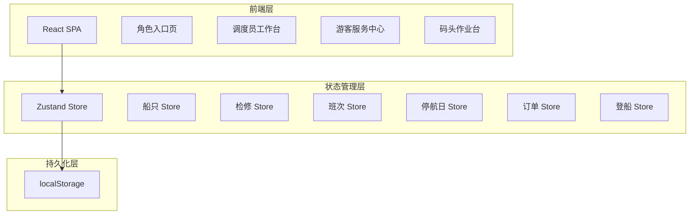
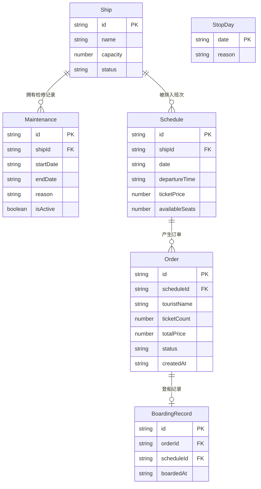

## 1. 架构设计



纯前端架构，数据持久化到浏览器 localStorage，无需后端服务。

## 2. 技术说明

- **前端**: React 18 + TypeScript + Tailwind CSS 3 + Vite
- **初始化工具**: vite-init
- **后端**: 无（纯前端，数据存 localStorage）
- **状态管理**: Zustand（含 persist 中间件自动同步 localStorage）
- **路由**: react-router-dom v6
- **图标**: lucide-react
- **容器化**: Docker + Nginx 静态托管

## 3. 路由定义

| 路由 | 用途 |
|------|------|
| `/` | 角色入口页，三角色选择 |
| `/dispatcher` | 调度员工作台首页（船只管理） |
| `/dispatcher/maintenance` | 调度员检修管理 |
| `/dispatcher/schedule` | 调度员班次管理 |
| `/dispatcher/stop-days` | 调度员停航日历 |
| `/tourist` | 游客班次查询 |
| `/tourist/order` | 游客我的订单 |
| `/dock` | 码头登船登记 |
| `/dock/records` | 码头登船记录 |

## 4. API 定义

无后端 API，所有数据操作通过 Zustand Store 完成。

### 核心 Store 接口定义

```typescript
interface Ship {
  id: string;
  name: string;
  capacity: number;
  status: "available" | "maintenance";
}

interface Maintenance {
  id: string;
  shipId: string;
  startDate: string;
  endDate: string;
  reason: string;
  isActive: boolean;
}

interface Schedule {
  id: string;
  shipId: string;
  date: string;
  departureTime: string;
  ticketPrice: number;
  availableSeats: number;
}

interface StopDay {
  date: string;
  reason: string;
}

interface Order {
  id: string;
  scheduleId: string;
  touristName: string;
  ticketCount: number;
  totalPrice: number;
  status: "pending" | "boarded" | "refunded";
  createdAt: string;
}

interface BoardingRecord {
  id: string;
  orderId: string;
  scheduleId: string;
  boardedAt: string;
}
```

## 5. 数据模型

### 5.1 数据模型定义



### 5.2 业务规则校验

| 规则 | 校验时机 | 实现方式 |
|------|----------|----------|
| 大风停航日不能售票 | 游客购票时 | 检查 StopDay Store 是否包含该日期 |
| 检修中的船不能排班 | 调度员创建班次时 | 检查 Maintenance Store 该船是否有进行中检修 |
| 已登船的订单不能退票 | 游客退票时 | 检查 Order.status !== "boarded" |

## 6. 容器化方案

```dockerfile
FROM node:20-alpine AS build
WORKDIR /app
COPY package*.json ./
RUN npm ci
COPY . .
RUN npm run build

FROM nginx:alpine
COPY --from=build /app/dist /usr/share/nginx/html
COPY nginx.conf /etc/nginx/conf.d/default.conf
EXPOSE 80
CMD ["nginx", "-g", "daemon off;"]
```

Nginx 配置需处理 SPA 路由回退：
```
location / {
  try_files $uri $uri/ /index.html;
}
```
